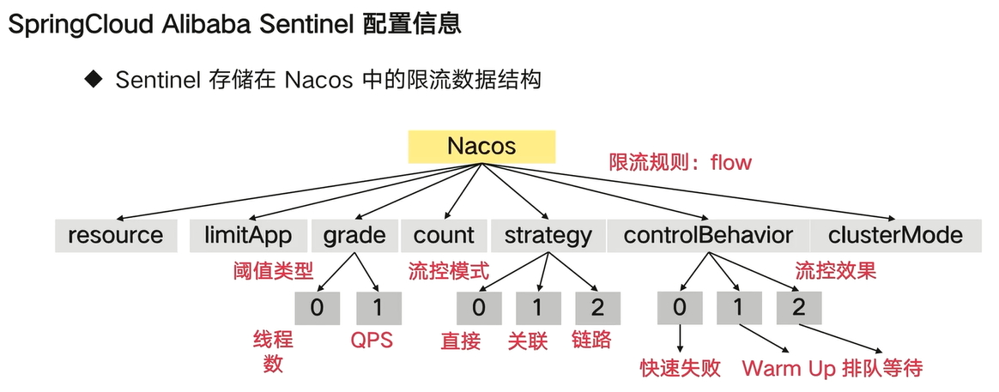

# cloud-web-01

spring-cloud工程使用例子

使用步骤：

1、添加依赖

```xml
        <!--  SpringCloud2020版本默认不启用bootstrap配置，
        需要加入依赖 spring-cloud-starter-bootstrap -->
        <dependency>
            <groupId>org.springframework.cloud</groupId>
            <artifactId>spring-cloud-starter-bootstrap</artifactId>
        </dependency>
        <dependency>
            <groupId>com.alibaba.cloud</groupId>
            <artifactId>spring-cloud-starter-alibaba-nacos-config</artifactId>
        </dependency>
        <dependency>
            <groupId>com.alibaba.cloud</groupId>
            <artifactId>spring-cloud-starter-alibaba-nacos-discovery</artifactId>
        </dependency>
```

2、nacos-config 、logging 配置必须写在 bootstrap.yaml 中

3、nacos-discovery 配置写在 application.yaml 中

4、启动类添加 @EnableDiscoveryClient

## Sleuth + Zipkin 分布式日志追踪

1、下载 zipkin-server

https://repo1.maven.org/maven2/io/zipkin/java/zipkin-server/2.12.9/zipkin-server-2.12.9-exec.jar

2、使用 mysql 持久化

    创建数据库 zipkin，字符集=utf8 ，排序规则=utf8_general_ci

    执行初始化 SQL，地址：https://github.com/openzipkin/zipkin/blob/master/zipkin-storage/mysql-v1/src/main/resources/mysql.sql 

3、启动 zipkin-server-2.12.9-exec.jar 。服务访问地址：http://localhost:10103/zipkin

    java -Xmx512m -Xms512m -jar zipkin-server-2.12.9-exec.jar --STORAGE_TYPE=mysql --MYSQL_HOST=127.0.0.1 --MYSQL_TCP_PORT=3306 --MYSQL_USER=root --MYSQL_PASS=cpq..123 --MYSQL_DB=zipkin --QUERY_PORT=10103

4、工程添加依赖

```xml
    <dependency>
        <groupId>org.springframework.cloud</groupId>
        <artifactId>spring-cloud-starter-sleuth</artifactId>
    </dependency>
    <dependency>
        <groupId>org.springframework.cloud</groupId>
        <artifactId>spring-cloud-sleuth-zipkin</artifactId>
    </dependency>
```

5、修改配置文件

```yaml
spring:
  # sleuth + zipkin 分布式链路追踪
  sleuth:
    sampler:
      # ProbabilityBasedSampler 抽样策略
      probability: 1.0  # 采样比例, 1.0 表示 100%, 默认是 0.1
      # RateLimitingSampler 抽样策略, 设置了限速采集, spring.sleuth.sampler.probability 属性值无效
      rate: 100  # 每秒间隔接受的 trace 量
  zipkin:
    sender:
      # 指定通过什么类型发送消息 默认是 web
      type: WEB
    # 指定 zipkin 的地址
    base-url: http://localhost:10103
```

6、配置日志的xml添加 [%X{traceId},%X{spanId}]

7、运行项目，发送请求。

8、升级到 spring cloud 2020 后，服务端没接收到数据

## openfeign

1、导入依赖包

```xml
    <!-- loadbalancer 将替换 ribbon -->
    <dependency>
        <groupId>org.springframework.cloud</groupId>
        <artifactId>spring-cloud-starter-loadbalancer</artifactId>
    </dependency>

    <dependency>
        <groupId>org.springframework.cloud</groupId>
        <artifactId>spring-cloud-starter-openfeign</artifactId>
    </dependency>
    <!-- feign 替换 JDK 默认的 URLConnection 为 okhttp -->
    <dependency>
        <groupId>io.github.openfeign</groupId>
        <artifactId>feign-okhttp</artifactId>
    </dependency>
```

2、添加配置

```yxml
# Feign 的相关配置
feign:
  # feign 开启 gzip 压缩
  compression:
    # 对请求进行压缩
    request:
      enabled: true
      # 针对以下类型的数据进行压缩
      mime-types: text/xml,application/xml,application/json
      # 大于1M的数据才进行压缩
      min-request-size: 1024
    # 响应时进行压缩
    response:
      enabled: true
  # 禁用默认的 http
  httpclient:
    enabled: false
  # 启用 okhttp
  okhttp:
    enabled: true
```

3、启动类添加 @EnableFeignClients("com.github.codingsoldier.example")

4、添加配置类 FeignConfig、FeignOkHttpConfig

5、配置级别日志 org: debug ，控制台打印

    Sending a request via tracing feign client [org.springframework.cloud.sleuth.instrument.web.client.feign.TracingFeignClient@16a13a30] and the delegate [feign.okhttp.OkHttpClient@742d5808]

表明 okhttp 生效

## sentinel

### sentinel 控制台 sentinel-dashboard

1、下载 sentinel-dashboard ，下载地址：https://github.com/alibaba/Sentinel/releases

2、启动 sentinel-dashboard ，启动命令：

    java -Dserver.port=10102 -Dcsp.sentinel.dashboard.server=localhost:10102 -Dproject.name=sentinel-dashboard -jar sentinel-dashboard-1.8.4.jar

3、访问地址：http://localhost:10102/#/dashboard/home

4、更多 sentinel-dashboard
文档：https://github.com/alibaba/Sentinel/wiki/%E6%96%B0%E6%89%8B%E6%8C%87%E5%8D%97#%E5%85%AC%E7%BD%91-demo

### 客户端使用 sentinel

1、导入依赖

```xml
        <!-- spring-cloud-sentinel 和 sentinel-nacos -->
        <dependency>
            <groupId>com.alibaba.cloud</groupId>
            <artifactId>spring-cloud-starter-alibaba-sentinel</artifactId>
        </dependency>
        <dependency>
            <groupId>com.alibaba.csp</groupId>
            <artifactId>sentinel-datasource-nacos</artifactId>
        </dependency>
```

2、添加配置文件

```yaml
spring:
  cloud:
    sentinel:
      transport:
        # 配置 sentinel dashboard 地址
        dashboard: 127.0.0.1:10102
        # 配置端口，启动一个 Http Server, 该 Server 会与 Sentinel 控制台做交互
        port: 10112
```

3、新建 RateLimitController 、SimpleBlockHandler ，发送一次请求。

刷新 sentinel-dashboard ，即可看到多了一个服务

4、在 dashboard 中 "流控规则" 中新增流控规则。资源名为“byResource”


5、快速发送多次请求：http://localhost:8001/cloud-web-01/sentinel/dashboard/by-resource

触发熔断

6、也可以通过“簇点链路”中通过url建立“流控规则”


7、客户端规则默认存储在内存中，重启客户端，规则会消失

### sentinel 与 nacos 整合，实现规则持久化

1、导入依赖

```xml
        <dependency>
            <groupId>com.alibaba.csp</groupId>
            <artifactId>sentinel-datasource-nacos</artifactId>
        </dependency>
```

2、添加配置文件

```yaml
spring:
  cloud:
    sentinel:
      transport:
        # 配置 sentinel dashboard 地址
        dashboard: 127.0.0.1:10102
        # 配置端口，启动一个 Http Server, 该 Server 会与 Sentinel 控制台做交互
        port: 10112
      datasource:
        # 名称任意, 代表数据源
        ds:
          nacos:
            # sentinel 整合 nacos 实现规则持久化
            server-addr: ${spring.cloud.nacos.discovery.server-addr}

.            password: nacos
            dataId: ${spring.application.name}-sentinel
            namespace: ${spring.cloud.nacos.discovery.namespace}
            groupId: DEFAULT_GROUP
            data-type: json
            # 规则类型: com.alibaba.cloud.sentinel.datasource.RuleType
            # FlowRule 就是限流规则
            rule-type: flow
```

3、nacos 新建dataId = ${spring.application.name}-sentinel，类型是json，添加如下配置

```json
[
    {
        "resource": "fromNacos",
        "limitApp": "default",
        "grade": 1,
        "count": 1,
        "strategy": 0,
        "controlBehavior": 0,
        "clusterMode": false
    }
]
```



4、添加方法：com.github.codingsoldier.example.cloudweb01.sentinel.RateLimitController.fromNacos

## openfeign 与 sentinel 整合

1、配置文件

```yaml
feign:
  # 打开 Sentinel 对 Feign 的支持
  sentinel:
    enabled: true
```

2、新增 Sentinel02Fallback 实现 Web02Feign02Client。配置 Web02Feign02Client 的 fallback= Sentinel02Fallback.class

或者

新增 Sentinel02FallbackFactory。配置 Web02Feign02Client 的 fallbackFactory= Sentinel02FallbackFactory.class
