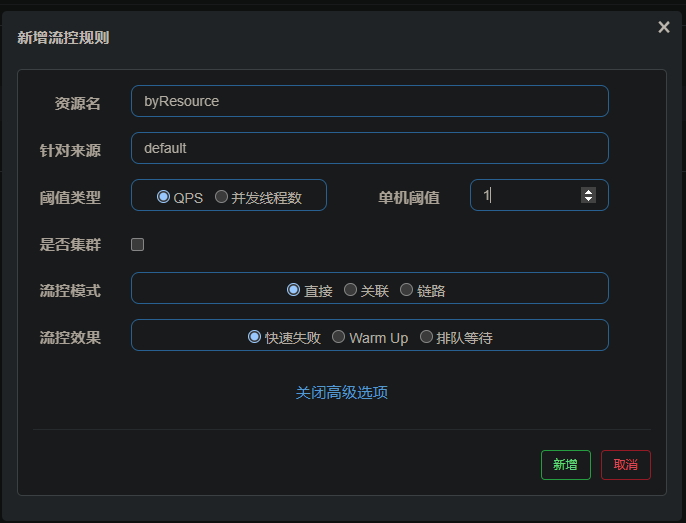
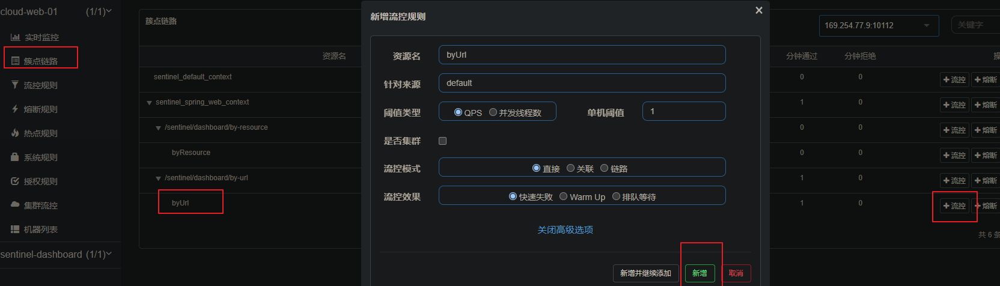

# middlewares-server
1、middlewares-server 放置常用中间件服务，可以启动运行。

2、middlewares-server 不是 framework-parent 的子模块。

# 常用中间件服务
## nacos
安装 nacos

https://nacos.io/zh-cn/docs/quick-start.html

## spring-boot-admin-server 
[更多说明](./middlewares-server-parent/spring-boot-admin-server/README.md)

## zipkin-server
1、下载 zipkin-server

https://repo1.maven.org/maven2/io/zipkin/java/zipkin-server/2.12.9/zipkin-server-2.12.9-exec.jar

2、使用 mysql 持久化

    创建数据库 zipkin，字符集=utf8 ，排序规则=utf8_general_ci

    执行初始化 SQL，地址：https://github.com/openzipkin/zipkin/blob/master/zipkin-storage/mysql-v1/src/main/resources/mysql.sql 

3、启动 zipkin-server-2.12.9-exec.jar 。服务访问地址：http://localhost:10103/zipkin

    java -Xmx512m -Xms512m -jar zipkin-server-2.12.9-exec.jar --STORAGE_TYPE=mysql --MYSQL_HOST=127.0.0.1 --MYSQL_TCP_PORT=3306 --MYSQL_USER=root --MYSQL_PASS=cpq..123 --MYSQL_DB=zipkin --QUERY_PORT=10103

## hystrix-dashboard
[更多说明](./middlewares-server-parent/hystrix-dashboard/README.md)

## sentinel
### sentinel 控制台 sentinel-dashboard
1、下载 sentinel-dashboard ，下载地址：https://github.com/alibaba/Sentinel/releases

2、启动 sentinel-dashboard ，启动命令：

    java -Dserver.port=10102 -Dcsp.sentinel.dashboard.server=localhost:10102 -Dproject.name=sentinel-dashboard -jar sentinel-dashboard-1.8.4.jar

3、访问地址：http://localhost:10102/#/dashboard/home

4、更多 sentinel-dashboard 文档：https://github.com/alibaba/Sentinel/wiki/%E6%96%B0%E6%89%8B%E6%8C%87%E5%8D%97#%E5%85%AC%E7%BD%91-demo

### 客户端使用 sentinel
1、导入依赖
```xml
        <!-- spring-cloud-sentinel 和 sentinel-nacos -->
        <dependency>
            <groupId>com.alibaba.cloud</groupId>
            <artifactId>spring-cloud-starter-alibaba-sentinel</artifactId>
        </dependency>
        <dependency>
            <groupId>com.alibaba.csp</groupId>
            <artifactId>sentinel-datasource-nacos</artifactId>
        </dependency>
```

2、添加配置文件
```yaml
spring:
  cloud:
    sentinel:
      transport:
        # 配置 sentinel dashboard 地址
        dashboard: 127.0.0.1:10102
        # 配置端口，启动一个 Http Server, 该 Server 会与 Sentinel 控制台做交互
        port: 10112
```
3、新建 RateLimitController 、SimpleBlockHandler ，发送一次请求。

刷新 sentinel-dashboard ，即可看到多了一个服务

4、在 dashboard 中 "流控规则" 中新增流控规则。资源名为“byResource”


5、快速发送多次请求：http://localhost:8001/cloud-web-01/sentinel/dashboard/by-resource

触发熔断

6、也可以通过“簇点链路”中通过url建立“流控规则”


7、客户端重启后流控规则会消失