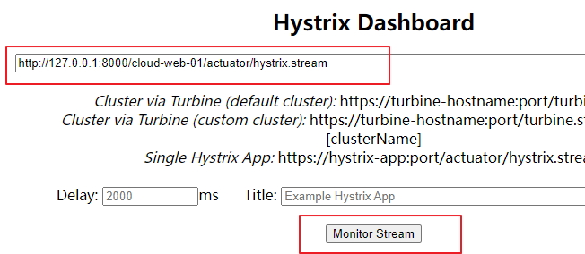
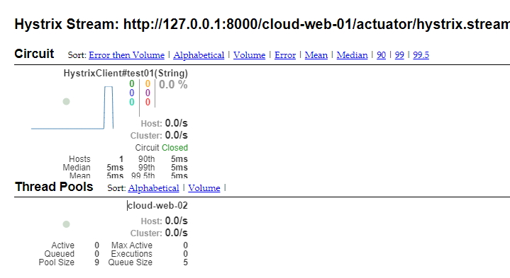

# spring-cloud 2020 已经移除 hystrix 

# hystrix-dashboard 
实时监控Hystrix的各项指标信息

1、访问地址：http://127.0.0.1:10101/hystrix-dashboard/hystrix/

2、启动 gateway、cloud-web-01、cloud-web-02

输入：http://127.0.0.1:8000/cloud-web-01/actuator/hystrix.stream

点击按钮 Monitor Stream

3、hystrix-dashboard 是实时监控系统

发送请求  http://localhost:8000/cloud-web-01/hystrix/test01?msg=中文

即可在 hystrix-dashboard 查看 hystrix的各项指标信息

